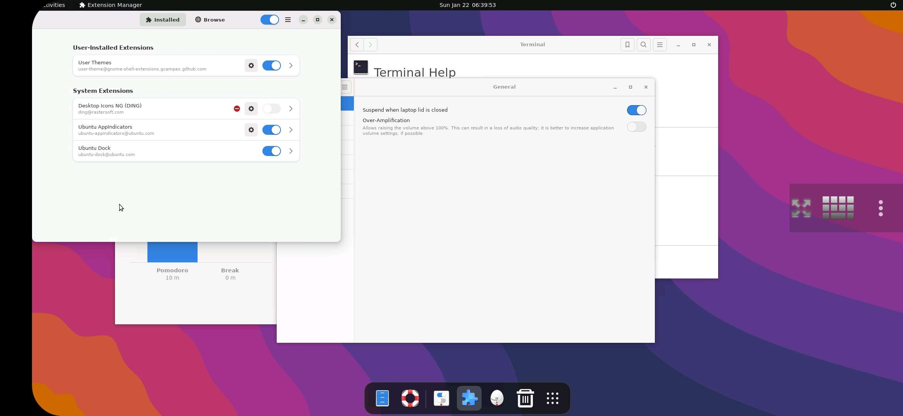
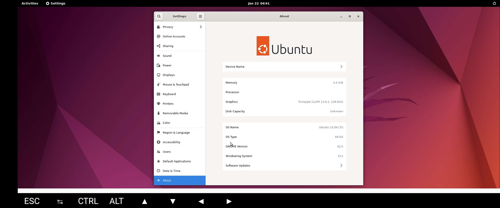
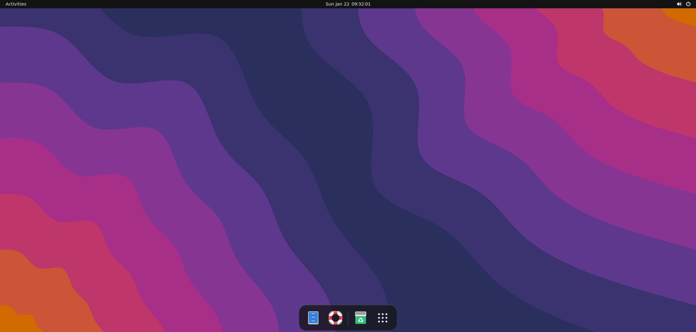
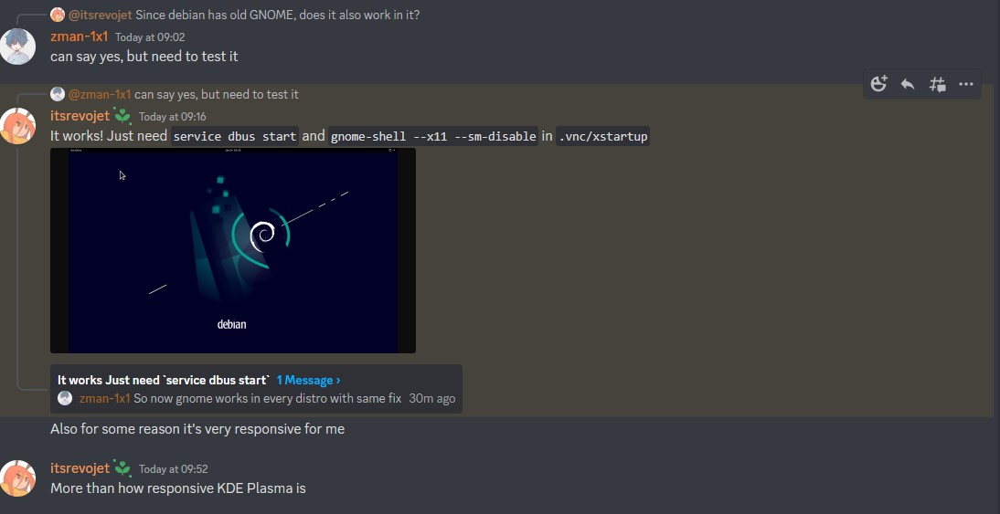

## The story
Almost everyone in proot community gave up on gnome Desktop environment due to its dependency on systemd. Even micro fixes like **fake systemctl** to start gnome dependend services resulted crashed in `gnome-shell` startup, this left the only way to experience `gnome-session-flashback` ( the old gnome session ) which is not that good in looks as compared to the new gnome 40+ version.

starting gnome-shell manually crashed cause some js failed to load shell themes, but now may be cause of new fixed in latest gnome-shell, gnome-shell started to work in proot.

## How to setup Gnome in Android

More like how to setup gnome in termux app

> Do remember that this is not a stable Desktop Environ,ent, it may break anytime, 
> 
> -> this guide install sets up minimal version of gnome
> -> considers you know how to setup [termux-x11](https://github.com/termux/termux-x11) ( just to keep page small )

### **udroid** user

1. Install the latest version [fs-manager-udroid](https://github.com/RandomCoderOrg/fs-manager-udroid/tree/revamp-v2.5)

```bash
git clone https://github.com/RandomCoderOrg/fs-manager-udroid.git
cd fs-manager-udroid
bash install.sh
udroid upgrade
```

2. Install **ubuntu 22.04 Jammy** ( cause its only distro with gnome 42 and the one i tested )

```bash
udroid install jammy:raw
```

3. Login to ubuntu 22.04 jammy

```bash
udroid login jammy:raw
```
> an unstable build of gnome is avalible with by `jammy:gnome` tag

1. Install gnome

```bash
apt update
apt install -y ubuntu-desktop-minimal dbus-x11 x11-utils
```

5. Start gnome

```bash
service dbus start
DISPLAY=:0 gnome-shell --x11
```

> You may need to setup all the use theme extension,  browser to get the look like in banner


### **proot-distro** users

its almost similar

1. Install `proot-distro` with apt

```bash
apt update
apt install proot-distro -y
```

2. Install ubuntu with proot-distro

```bash
proot-distro install ubuntu
```

3. Login to ubuntu with `cap_last_cap` fix and `--shared-tmp` for **termux-x11**

```bash
proot-distro login ubuntu --bind /dev/null:/proc/sys/kernel/cap_last_cap --shared-tmp
```
3. Install gnome

```bash
apt update
apt install -y ubuntu-desktop-minimal dbus-x11 x11-utils
```

4. Start gnome

```bash
service dbus start
DISPLAY=:0 gnome-shell --x11
```

## Some screenshots





## Conclusion

Even gnome works now but there are so many things that just crashes cause of missing services ( which usually started by `gnome-session` with `systemd` ) and the normal proot issues

some of em:
- `gnome-control-center` Gnome settings just crashes for ever if you try to open sound settings ( removing `.cache`, `.config` and `.local` from `~` is a fix )
- using gnome in termux-x11 crashes app so often
- gnome is way more stable in vnc ( just  the UI part )
- can't use extenstions that need direct to root files of android
- video output is just nightmare with 1 - 7 FPS in software encoding ( may feel better for zink users )

> this environment needs a lot of workarounds for sure
>

Also extensions like burn my windows works too, so time for **some fancy setups**

### About other distros

So according to some members in [udroid discord server chat](https://discord.gg/AGqQCHuE6S) gnome is also working in latest debian suites like bullseye



Well if you got favorite distro other than ubuntu do test it out and comment here

And expect for a better gnome build avalibe in [udroid](https://github.com/RandomCoderOrg/ubuntu-on-android) soon

✌️
